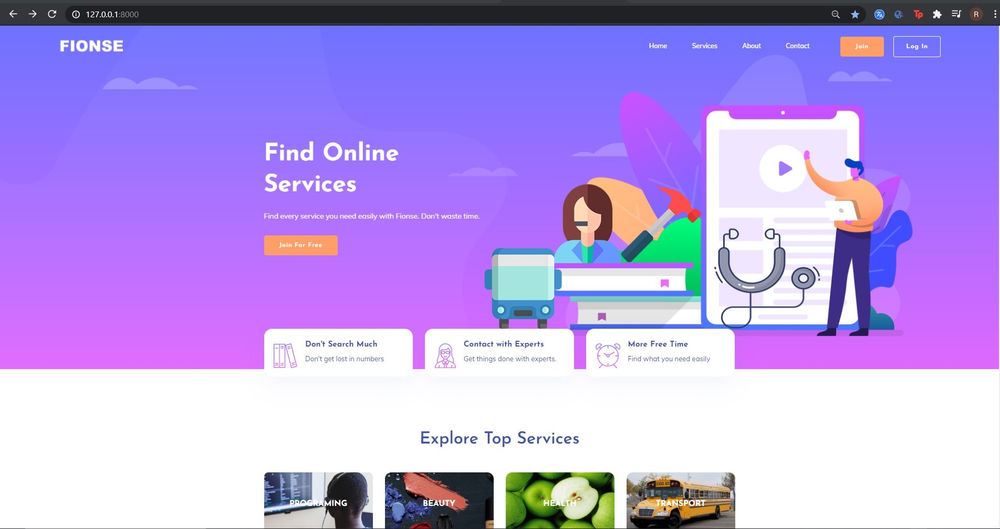
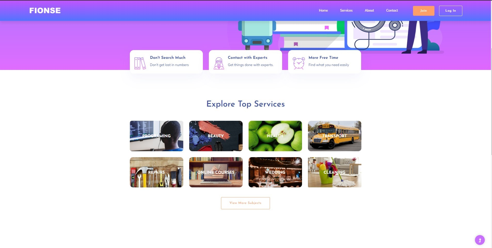
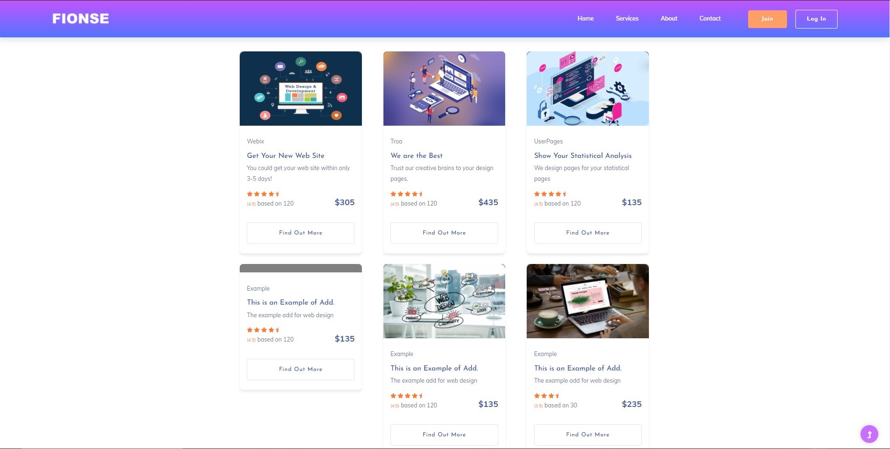
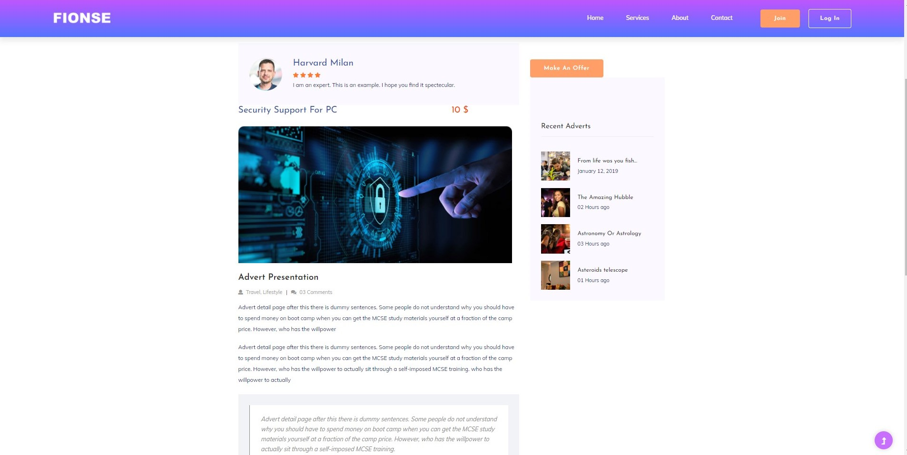

#SERVICE PROVIDER APLLICATION


This is an demo project for  finding services online. Django==2.2.5 Bootstrap cryptography 
Thanks for providing free templates to colorlib. https://colorlib.com/wp/cat/education/













To Find Out More Check templatesStatics


Setup

#Creating Virtual Environment For Project
pip install virtualenv
virtualenv env 

Linux & Mac: ```source env/bin/activate```

Windows: ```env\Scripts\activate```

cd SPA\serviceapp

```pip install -r requirements.txt```

```python manage.py makemigrations```

```python manage.py migrate``` #Ignore Warnings#

```python manage.py runserver```

Type your Browser ==> http://127.0.0.1:8000/

To see all html files travel like

Programming ==> Web Design ==> Get Your Website (Find Out More)

All html,css,img.. files in templatesStatics folder.

